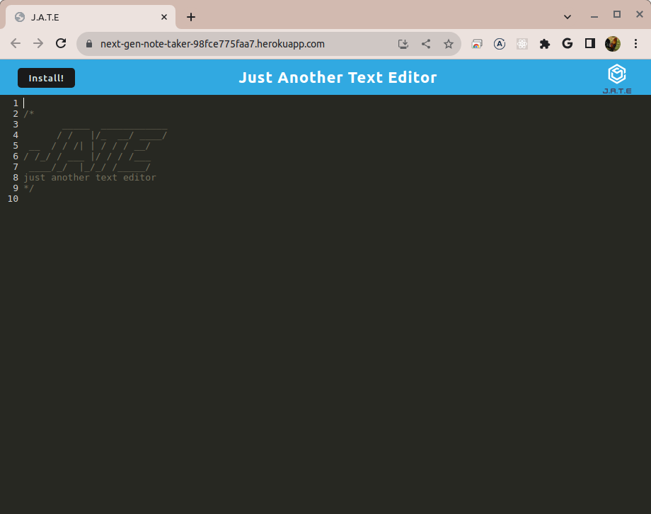
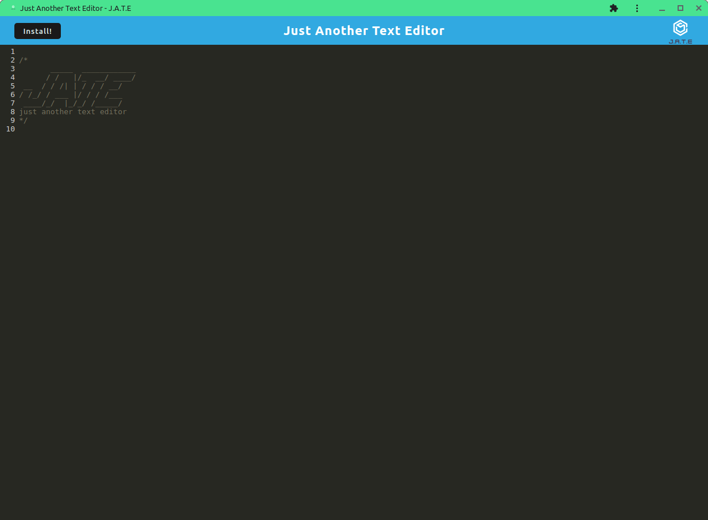

# PWA Challenge: Text Editor

## Description

A note taking Progressive Web Application utilizing indexedDB local storage and WebPack.

## Table of Contents

- [Deployment](#deployment)
- [Technologies](#technologies)
- [Installation](#installation)
- [Usage](#usage)
- [Screenshots](#screenshots)
- [License](#license)
- [Contributing](#contributing)

## Deployment
<a href="https://next-gen-note-taker-98fce775faa7.herokuapp.com/">Deployed application</a>

## Technologies

This application is built on top of the following technologies, and others:

 

## Installation

To install this application, perform the following:

Clone the repository, change to the cloned application directory, and run "npm run install."

## Usage

To run this application, first build by entering "npm run build" in the terminal and  hit the "Enter" key, then start it by entering "npm run start" in the terminal and  hit the "Enter" key.

## Screenshots

 

## License

[MIT](./LICENSE) © MyComplex

## Contributing

Feel free to fork this repository and create a Pull Request.

## Questions

If you have any questions, please feel free to reach out to me via [email](mailto:jo_nez@hotmail.com) or on [Github](https://github.com/MyComplex/).